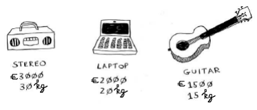
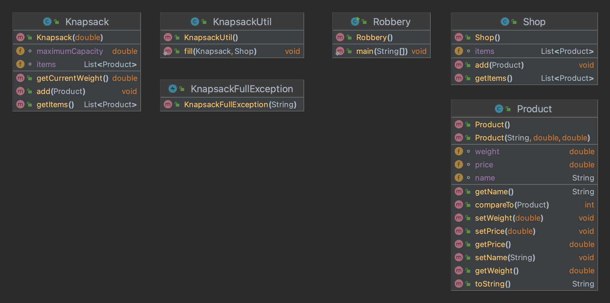
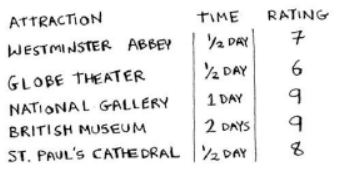
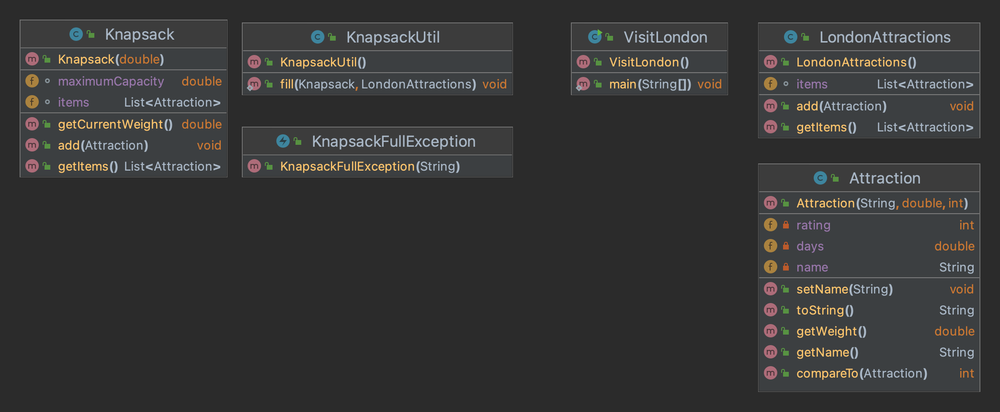
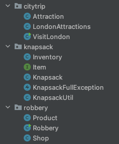

# Generics oefening - Het knapzak probleem

## Opgave 1 : Use case Robbery
Een dief gaat ’s nachts op pad om een winkel te beroven.  
In de winkel staan 3 producten. De dief kan echter maar meenemen wat er in zijn rugzak (knapzak) past. In de rugzak kan hij 35kg dragen.  
Wij gaan de dief helpen om te beslissen welke items hij in de rugzak zal steken.   
We gaan een greedy (gulzig) algoritme implementeren.  
Dit is een eenvoudig algoritme:
1. Neem het duurste item dat nog in de rugzak past.
2. Neem het volgende duurste item dat nog in de rugzak past.
3. En zo verder ...


   
De rugzak kan 35kg aan goederen dragen, dus we stellen voor om de stereo te stelen.  
Er is, na het stelen van de stereo, geen plaats meer om extra items in de rugzak te steken.  
Het greedy algoritme zal geen optimale oplossing geven.  
Hadden we de laptop en de gitaar laten stelen, dan was de rugzak vol en hadden we een totale waarde van €3500 in plaats van €3000.   
Momenteel hebben we echter voldoende aan een greedy algoritme dat ons probleem redelijk goed, maar niet perfect, kan oplossen.

### KnapsackFullException.java
Voorzie deze checked exception klasse. Voorzie een constructor waarbij je een foutboodschap kan meegeven.

### Knapsack.java
Deze klasse representeert de rugzak met een bepaald maximum gewicht.  
In de constructor geef je de maximumCapacity van de Knapsack mee.  
Voorzie een methode getCurrentWeight() om de som van de gewichten van alle elementen in de Knapsack op te vragen.  
Voorzie een methode add() om een element toe te voegen. Als het toevoegen van het gegeven element de maximumCapacity van de Knapsack overschrijdt, gooi je een KnapsackFullException met een duidelijke boodschap en zorg je ervoor dat het element niet in de Knapsack terechtkomt.  
Voorzie tenslotte een methode getItems() om alle elementen uit de Knapsack op te vragen.

### KnapsackTest.java
Voorzie unittesten voor de methode getCurrentWeight().  
Voorzie unittesten voor de methode add() om een element toe te voegen.

### Product.java
Een product heeft 3 eigenschappen: name, weight en price. Voorzie getters en setters.  
Voorzie een zinvolle toString()-methode.  
Zorg ervoor dat een product kan vergeleken/gesorteerd worden op basis van zijn prijs.   
Dit kan je doen aan de hand van compareTo().  
Een negatieve waarde krijg je als de prijs van “this”-object groter is, dan de prijs van de opgegeven parameter.   
Een positieve waarde wordt gegeven wanneer de prijs van “this” object kleiner is dan de prijs van de opgegeven parameter.   
Het resultaat is 0 als de prijzen van beide objecten gelijk zijn.  

### ProductTest.java
Voorzie unittesten voor de compareTo() methode.

### Shop.java
Deze klasse is een inventaris van alle producten (klasse Product).  
Aan deze inventaris kan een product toegevoegd worden met de methode add(Product item).  
Van de inventaris kan men de lijst van producten opvragen met de methode getItems().  
Deze klasse is reeds gegeven en compleet.

### KnapsackUtil.java
Deze klasse staat in voor het greedy algoritme.  
De klasse bevat 1 public static methode fill met een knapsack en een Shop inventaris als argument.  
In de fill-methode worden eerst alle producten uit de shop gesorteerd (gebruik hiervoor een methode uit de klasse Collections!).   
Vervolgens probeer je deze gesorteerde producten 1 voor 1 toe te voegen aan de Knapsack.

### Robbery.java (main)
Deze klasse is reeds gegeven en kan uitgevoerd worden.  
Output:
```
Cannot add product [laptop]. Maximum capacity reached.

List of products:
Product{name='stereo', weight=30.0, price=3000.0}
```
Voeg ook eens extra producten toe in de shop en/of pas de capaciteit van de Knapsack eens aan.

### EXTRA: KnapsackUtilTest.java
Voorzie unittesten voor de fill methode.  
Met behulp van dergelijke unittesten is de main klasse niet meer nodig om de functionaliteiten uit te proberen.

### Klassendiagram


___

## Opgave 2 : Use case Citytrip
Veronderstel dat je voor een weekend naar Londen gaat. Je kan ontzettend veel
bezoeken, maar jammer genoeg heb je maar 2 dagen. We maken een lijst van de
attracties die we kunnen bezoeken. 
Ons greedy algoritme gaat bepalen wat we in London gaan doen!



### KnapsackFullException.java
Voorzie deze checked exception klasse. Voorzie een constructor waarbij je een foutboodschap kan meegeven.

### Knapsack.java
Deze klasse representeert het weekend met een maximum aantal dagen.  
In de constructor geef je de maximumCapacity van de Knapsack mee.  
Voorzie een methode getCurrentWeight() om de som van de gewichten van alle elementen in de Knapsack op te vragen.  
Voorzie een methode add() om een element toe te voegen. Als het toevoegen van het gegeven element de maximumCapacity van de Knapsack overschrijdt, gooi je een KnapsackFullException en zorg je ervoor dat het element niet in de Knapsack terechtkomt.  
Voorzie tenslotte een methode getItems() om alle elementen uit de Knapsack op te vragen.  

### KnapsackTest.java
Voorzie unittesten voor de methode getCurrentWeight().  
Voorzie unittesten voor de methode add() om een element toe te voegen.

### Attraction.java
Een Attraction heeft 3 eigenschappen: name, time en rating. Voorzie getters en setters.  
Voorzie een zinvolle toString()-methode.  
Zorg ervoor dat een attraction kan vergeleken/gesorteerd worden op basis van zijn rating.  
De compareTo wordt geïmplementeerd adhv de rating van een attractie.  
Een negatieve waarde krijg je als de rating van “this”-object groter is, dan de rating van de opgegeven parameter.  
Een positieve waarde wordt gegeven wanneer de rating van “this” object kleiner is dan de rating van de opgegeven parameter.  
Het resultaat is 0 als de ratings van beide objecten gelijk zijn.  
De methode getWeight() geeft de tijd terug die je voor een attractie voorziet.

### AttractionTest.java
Voorzie unittesten voor de compareTo() methode.

### LondonAttractions.java
Deze klasse is een inventaris van alle attracties in Londen (klasse LondonAttraction).  
Aan deze inventaris kan een attractie toegevoegd worden met de methode add(Attraction item).  
Van de inventaris kan men de lijst van attracties opvragen met de methode getItems().  
Deze klasse is reeds gegeven en compleet.

### KnapsackUtil.java
Deze klasse staat in voor het greedy algoritme.  
De klasse bevat 1 public static methode fill met een knapsack en een LondonAttractions inventaris als argument.  
In de fill-methode worden eerst alle attracties uit de inventaris gesorteerd (gebruik hiervoor een methode uit de klasse Collections!).
Vervolgens probeer je deze gesorteerde attracties 1 voor 1 toe te voegen aan de Knapsack.

### VisitLondon.java (main)
Deze klasse is reeds gegeven en kan uitgevoerd worden.  
Output:
```
Cannot add attraction [Westminster Abbey]. Maximum capacity reached.

List of attractions:
Attraction{name='British Museum', days=1.5, rating=9}
Attraction{name='St. Paul's Cathedral', days=0.5, rating=8}
```
Voeg ook eens extra attracties toe in de inventaris en/of pas de capaciteit van de Knapsack eens aan.

### EXTRA: KnapsackUtilTest.java
Voorzie unittesten voor de fill methode.  
Met behulp van dergelijke unittesten is de main klasse niet meer nodig om de functionaliteiten uit te proberen.

### Klassendiagram


___

## Opgave 3 : Refactor
Refactor de Knapsack klassen naar de aparte knapsack package en maak deze generisch zodat deze bruikbaar zijn voor beide opgaven.

### Tips
- Attraction en Product zijn beide items met een "gewicht"
- Shop en LondonAttractions zijn beide inventarissen van items met een gewicht
- Gewenste klassenstructuur
- 

